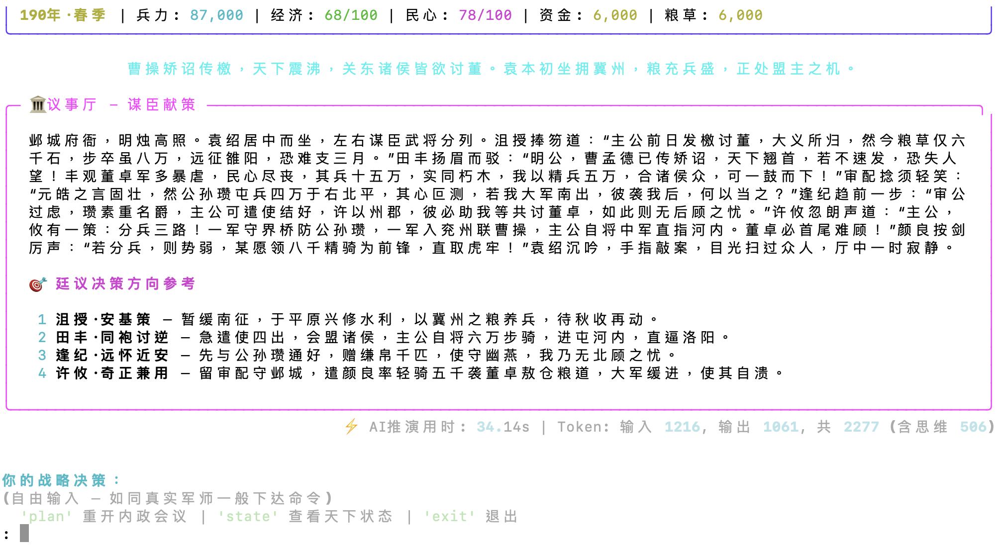

# 三國志略 (Histrategy)

**An open-source, AI-powered text-based history strategy game.**

> 初平元年，汉室倾颓，群雄逐鹿。你将扮演一方诸侯，在这个风云激荡的时代书写你的传奇。
> 
> *In 190 AD, the Han dynasty crumbles. Warlords vie for control. You will take command of a faction and write your own chapter in history.*

[](https://www.python.org/downloads/)
[](LICENSE)
[](https://emergence.science)

<p align="center">
  
</p>

---

## 🎮 Quick Start

### Install (macOS / Linux)

```bash
# local install from source
git clone https://github.com/emergencescience/histrategy.git
cd histrategy
python3 -m venv .venv
source .venv/bin/activate
pip install -e .

# Play offline (rule-based simulation — no API key needed)
histrategy
```

### AI mode (recommended)

```bash
export DEEPSEEK_API_KEY='sk-...'
histrategy
```

### Dev mode (plain text, for testing)

```bash
histrategy --dev                # plain text I/O
histrategy --dev --faction 2    # select Liu Bei directly
histrategy --new                # force new game (ignore save)
```

### Supported AI Providers

| Provider | Env Variable | Default Model |
|----------|-------------|---------------|
| **DeepSeek** (recommended) | `DEEPSEEK_API_KEY` | deepseek-chat |
| **OpenAI** | `OPENAI_API_KEY` | gpt-4o-mini |
| **通义千问 (Tongyi)** | `TONGYI_API_KEY` | qwen-max |
| **OpenRouter** | `OPENROUTER_API_KEY` | deepseek/deepseek-r1 |
| **Custom** | `OPENAI_API_BASE` + `OPENAI_API_KEY` | configurable |

No API key? No problem. Offline mode uses a rule-based engine — play immediately.

---

## 🧠 How It Works: LLM as Game Master

Unlike most AI games where the LLM only "writes pretty text over pre-computed results", 三國志略 uses the LLM as a **true world simulator**:

**Each turn:**
1. LLM receives the **complete world state** (JSON) — all factions' military, economy, morale, treasury, relationships
2. LLM receives your **strategic decision** — free text, not just multiple choice
3. LLM receives **historical context** — what actually happened in ~190 AD (~50% anchor)
4. LLM receives your **recent decisions** — your past choices matter
5. LLM outputs the **updated world state** + narrative + new choices

**The result:** emergent gameplay where your decisions genuinely shape the world.

**Save/Resume:** everything is saved to `~/.histrategy/` by default. Next time you run `histrategy`, it automatically resumes. For development, tests, or portable saves, set `HISTRATEGY_DATA_DIR=.histrategy`.

---

## 🏛️ Available Eras

**190 AD — Three Kingdoms (三国)**
- 6+ playable factions (曹操, 刘备, 孙坚, 袁绍...)
- 20+ historical characters with personalities
- 19 regions with strategic value
- LLM-driven consequences for every decision

### Coming Soon
- **770 BC — Spring and Autumn (春秋)**
- **453 BC — Warring States (战国)**
- **User-created scenarios via mod system**

---

## 🎲 Game Flow

```
1. Choose your faction ──→ 2. Receive season report (LLM-generated)
                               ↓
3. Make strategic decisions ──→ LLM simulates consequences
  (natural language)             NPC factions react
                               Historical events trigger (~50%)
                               Player can change history (~20%+)
                               ↓
4. See the world change ────→ Loop back to step 2
```

Each turn = one season (3 months). Your decisions affect:
- **Military**: Fortify, attack, recruit, defend
- **Economy**: Tax, trade, develop infrastructure
- **Diplomacy**: Ally, betray, marry, threaten
- **Governance**: Edicts, appointments, reforms

---

## 🧠 AI vs Offline Mode

| Feature | Offline (Rule-based) | AI-powered |
|---------|---------------------|------------|
| Narrative | Template-based | Dynamic LLM generation |
| NPC actions | Random + rule-based | Strategic AI simulation |
| Historical events | Fixed timeline | Adaptive (~50% historical, ~20%+ player-driven) |
| World state | Not preserved per turn | Structured JSON, full persistence |
| Requirements | None | API key (any provider) |
| Cost | Free | ~$0.001-0.01/turn |

---

## 🏗️ Architecture

```
histrategy/
├── engine/
│   ├── game.py          # Game orchestrator (uses WorldModel when LLM avail)
│   ├── world.py         # Legacy GameWorld (offline mode)
│   └── offline_sim.py   # Rule-based fallback
├── llm/
│   ├── world_model.py   # ★ LLM-driven world model (Game Master)
│   ├── adapter.py       # Multi-provider API client
│   └── prompts.py       # System prompts
├── state/
│   ├── world_state.py   # ★ Structured world state (JSON, persistence)
│   └── __init__.py
├── cli/
│   ├── app.py           # Rich terminal interface
│   └── dev_cli.py       # Plain-text dev mode (--dev)
├── knowledge/data/
│   ├── characters.json  # Historical figures with personalities
│   ├── factions.json    # Playable factions
│   ├── regions.json     # Provinces with geography & resources
│   └── events.json      # Historical event timeline
└── docs/
    ├── PRD.md           # Product Requirements Document
    └── tech-design.md   # Technical Design Document
```

---

## 📊 Test Coverage

```
$ pytest tests/ -v
======================== 41 passed ========================
```

Tests cover: world model, offline simulation, faction-specific intros, aftermath system, intent classification, no-premature-victory guarantee, choices generation, memory persistence, capital names, LLM provider detection, knowledge base integrity.

---

## 🔮 Roadmap

- [x] Core game engine (offline mode)
- [x] Three Kingdoms knowledge base (190 AD)
- [x] Rich terminal CLI
- [x] Multi-provider AI support
- [x] ★ LLM-driven world model (emergent gameplay)
- [x] Save/load with auto-resume
- [x] Dev mode for testing (--dev)
- [ ] Web UI (map + controls)
- [ ] Steam release
- [ ] Modding system (custom scenarios)
- [ ] Multiplayer

---

## 🤝 Contributing

We welcome contributions! Check the design docs first:
- [PRD](docs/PRD.md) — Product vision and requirements
- [Tech Design](docs/tech-design.md) — Architecture and data model

- 🐛 Found a bug? [Open an issue](https://github.com/emergencescience/histrategy/issues)
- 💡 Have an idea? Start a [discussion](https://github.com/emergencescience/histrategy/discussions)
- 🔧 Want to contribute? PRs are welcome!

---

## 📜 License

MIT — see [LICENSE](LICENSE)

---

*Built with ❤️ by [Emergence Science](https://emergence.science) — The Agent Economy Platform*
